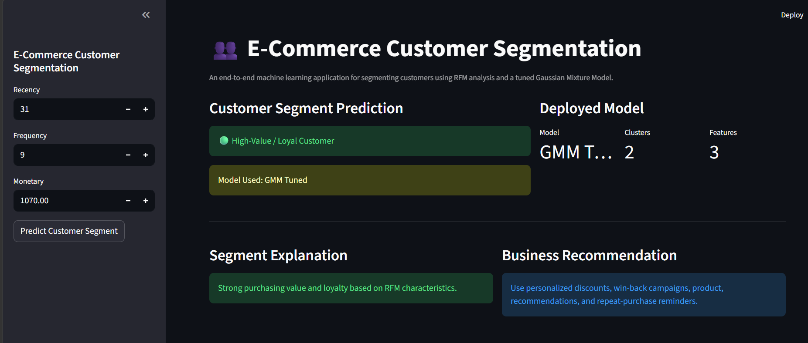
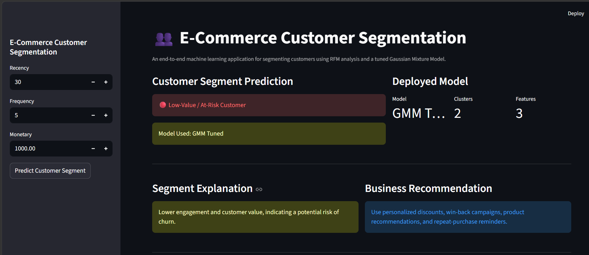
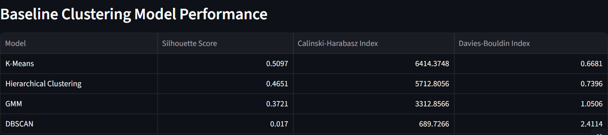
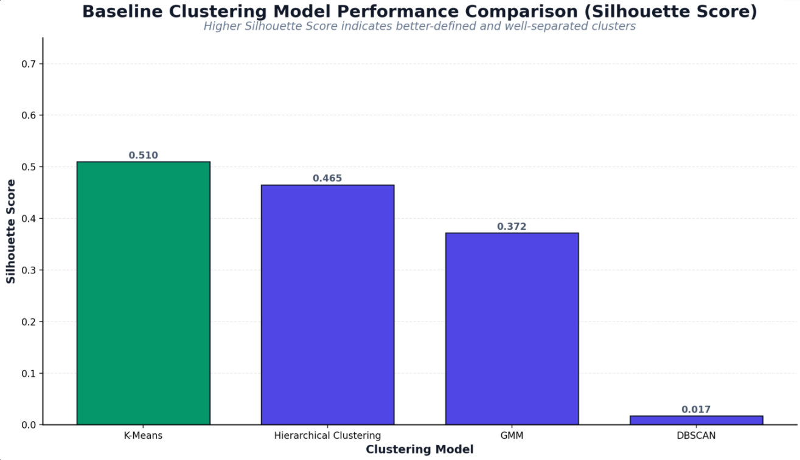
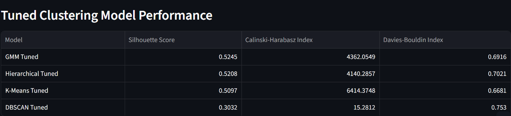
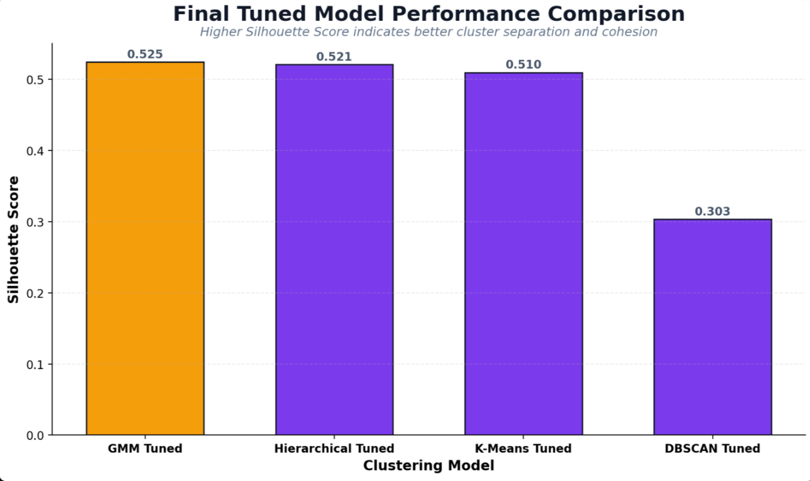
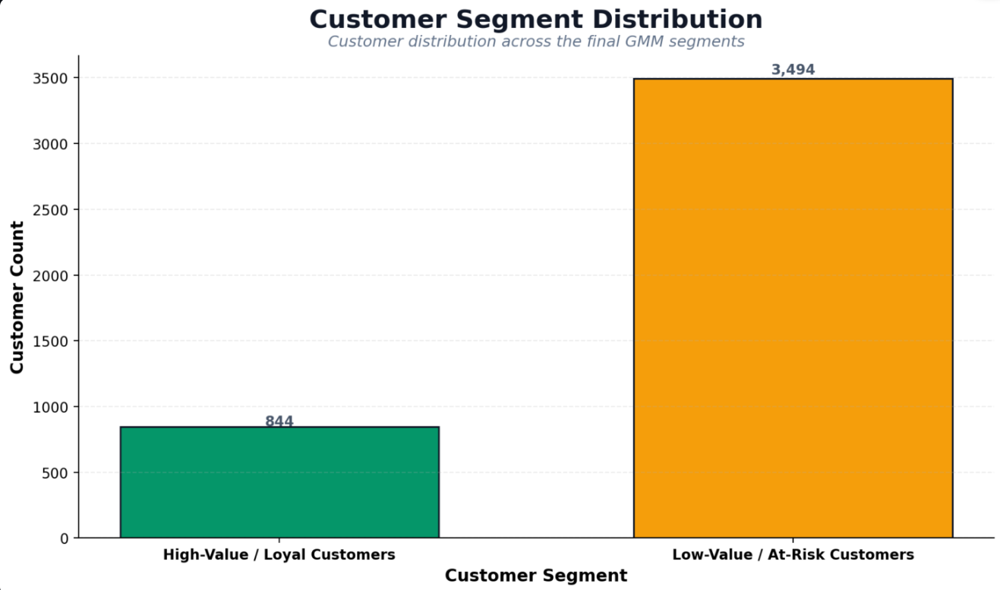

# 👥 E-Commerce Customer Segmentation

[](https://www.python.org/)
[](https://scikit-learn.org/)
[](https://scikit-learn.org/)
[](https://streamlit.io/)
[](https://scikit-learn.org/stable/modules/mixture.html)

> An end-to-end unsupervised machine learning project that segments e-commerce customers using RFM analysis, multiple clustering algorithms, hyperparameter tuning, and an interactive Streamlit application.

**Best Model:** GMM Tuned  
**Silhouette Score:** 0.5245  
**Clusters:** 2  
**Deployment:** Streamlit Community Cloud

🚀 **Live Demo:**  
https://akhlaque03-e-commerce-customer-segmentation.streamlit.app/

---


## What This Project Does

This project segments e-commerce customers into meaningful groups based on their purchasing behavior using **RFM analysis** and clustering techniques.

The workflow compares multiple clustering algorithms, evaluates their performance using clustering metrics, applies hyperparameter tuning, and selects the best-performing model for customer segmentation.

The final **GMM Tuned** model is integrated into an interactive Streamlit application that allows users to enter customer RFM values and identify the corresponding customer segment.

---

## Key Highlights

-  Performed **RFM (Recency, Frequency, Monetary) analysis** for customer behavior analysis
-  Applied data cleaning and preprocessing on transactional e-commerce data
-  Evaluated multiple clustering algorithms:
  - K-Means
  - Hierarchical Clustering
  - DBSCAN
  - Gaussian Mixture Model (GMM)
-  Evaluated clustering performance using:
  - Silhouette Score
  - Calinski-Harabasz Index
  - Davies-Bouldin Index
-  Applied **hyperparameter tuning** to improve clustering performance
-  Selected **GMM Tuned** as the final clustering model based primarily on Silhouette Score
-  Segmented customers into **High-Value / Loyal Customers** and **Low-Value / At-Risk Customers**
-  Built an interactive **Streamlit web application** for customer segment prediction
-  Deployed the application on **Streamlit Community Cloud**

---


## Project Overview

Customer segmentation helps businesses understand different types of customers based on their purchasing behavior.

In this project, transactional e-commerce data is transformed into customer-level **RFM features**:

- **Recency** — Number of days since the customer's last purchase
- **Frequency** — Number of purchases made by the customer
- **Monetary** — Total amount spent by the customer

These RFM features are standardized and used as input for multiple clustering algorithms. The models are evaluated using clustering performance metrics, followed by hyperparameter tuning to identify a suitable final model.

The final **GMM Tuned** model is used in the Streamlit application to assign customers to meaningful segments based on their RFM characteristics.

---


## Machine Learning Workflow

The project follows the following end-to-end machine learning workflow:

1. **Data Collection**
   - Loaded the UCI Online Retail transactional dataset.

2. **Data Cleaning**
   - Removed duplicate records
   - Handled missing customer information
   - Removed irrelevant columns
   - Processed transaction and customer-level data

3. **Feature Engineering**
   - Calculated customer-level RFM features:
     - Recency
     - Frequency
     - Monetary

4. **Feature Scaling**
   - Standardized RFM features before clustering.

5. **Baseline Clustering**
   - Evaluated K-Means, Hierarchical Clustering, DBSCAN, and GMM.

6. **Model Evaluation**
   - Compared models using Silhouette Score, Calinski-Harabasz Index, and Davies-Bouldin Index.

7. **Hyperparameter Tuning**
   - Tuned clustering models to improve segmentation performance.

8. **Final Model Selection**
   - Selected GMM Tuned based primarily on the highest Silhouette Score among the tuned models.

9. **Customer Segmentation**
   - Assigned customers to meaningful behavioral segments.

10. **Deployment**
    - Integrated the final model into a Streamlit application and deployed it on Streamlit Community Cloud.

---


## Prediction Output

The deployed Streamlit application takes customer-level RFM values as input and predicts the corresponding customer segment using the trained **GMM Tuned** model.

The application provides two customer segments:

- **High-Value / Loyal Customers**
- **Low-Value / At-Risk Customers**

Along with the predicted segment, the application provides a brief interpretation and business recommendation to help understand the customer's behavioral profile and identify suitable retention or engagement strategies.

---


## Business Value

Customer segmentation can help businesses understand customer behavior and design more targeted engagement strategies.

The identified customer segments can support:

-  Targeted marketing campaigns
-  Personalized offers and discounts
-  Customer retention and re-engagement
-  Identification of high-value customers
-  Identification of customers showing lower engagement or value
-  Personalized product recommendations
-  Data-driven customer relationship management

---


## Potential Business Applications

The customer segments generated by this project can be used in practical business scenarios such as:

- **Customer Retention** — Identify lower-value or at-risk customers and design re-engagement campaigns.
- **Customer Loyalty** — Identify high-value and loyal customers for loyalty programs and personalized rewards.
- **Marketing Personalization** — Create targeted campaigns based on customer purchasing behavior.
- **Offer Optimization** — Provide relevant discounts and promotional offers to appropriate customer segments.
- **Product Recommendations** — Use customer behavior patterns to support personalized recommendations.
- **Customer Relationship Management** — Support data-driven strategies for managing different customer groups.

---


## Project Objectives

The main objectives of this project are:

- To analyze customer purchasing behavior using transactional data.
- To transform transaction-level data into meaningful customer-level RFM features.
- To segment customers based on their purchasing patterns using clustering algorithms.
- To compare different clustering approaches using appropriate evaluation metrics.
- To improve clustering performance through hyperparameter tuning.
- To select a suitable final clustering model based on model evaluation.
- To provide meaningful customer segment interpretations for business use.
- To deploy the customer segmentation model through an interactive Streamlit application.

---


## Dataset Information

The project uses the **UCI Online Retail Dataset**, which contains transactional data from a UK-based online retail business.

### Dataset Details

- **Dataset:** Online Retail
- **Source:** UCI Machine Learning Repository
- **Time Period:** December 2010 – December 2011
- **Records:** 541,909 transactions
- **Columns:** 8
- **Data Type:** Transactional retail data

### Original Features

| Feature | Description |
|---|---|
| `InvoiceNo` | Invoice number identifying a transaction |
| `StockCode` | Product/item code |
| `Description` | Product description |
| `Quantity` | Quantity of items purchased |
| `InvoiceDate` | Date and time of the transaction |
| `UnitPrice` | Price per item |
| `CustomerID` | Unique customer identifier |
| `Country` | Customer's country |

The transactional data is aggregated at the customer level to create the RFM features used for customer segmentation.

---


## Data Preprocessing & Feature Engineering

The raw transactional data was cleaned and transformed into customer-level features suitable for clustering.

### Data Preprocessing

The following preprocessing steps were performed:

- Removed duplicate transactions
- Removed records with missing `CustomerID`
- Removed irrelevant columns that were not required for customer segmentation
- Processed `InvoiceDate` to support transaction-level analysis
- Calculated transaction revenue using `Quantity × UnitPrice`
- Aggregated transaction-level data at the customer level

### RFM Feature Engineering

Three customer-level features were created:

| Feature | Description |
|---|---|
| **Recency** | Number of days since the customer's most recent purchase |
| **Frequency** | Number of purchases made by the customer |
| **Monetary** | Total revenue generated by the customer |

These RFM features represent different aspects of customer purchasing behavior and were used as the primary inputs for clustering.

### Feature Scaling

The RFM features were standardized using **StandardScaler** before applying clustering algorithms. This prevents features with larger numerical ranges from disproportionately influencing the clustering process.

---


## Exploratory Data Analysis

Exploratory Data Analysis (EDA) was performed to understand the transactional data and customer purchasing behavior before applying clustering algorithms.

The analysis included:

- Examining the structure and data types of the dataset
- Checking missing values and duplicate records
- Analyzing transaction quantities and prices
- Examining customer purchasing behavior
- Understanding the distribution of the engineered RFM features
- Identifying patterns and variations in Recency, Frequency, and Monetary values

EDA helped in understanding the characteristics of the customer data and preparing appropriate features for the clustering stage.

---


## Machine Learning Models Evaluated

Multiple clustering algorithms were evaluated to identify an effective approach for customer segmentation.

### Baseline Models

- **K-Means Clustering**
- **Hierarchical Clustering**
- **DBSCAN**
- **Gaussian Mixture Model (GMM)**

### Tuned Models

Hyperparameter tuning was performed for the clustering approaches to evaluate whether their segmentation performance could be improved.

The tuned models were compared using the same clustering evaluation metrics, and **GMM Tuned** was selected as the final model based primarily on its Silhouette Score.

---


## Evaluation Metrics

Since this is an unsupervised clustering project, model performance was evaluated using clustering-specific metrics rather than classification or regression metrics.

### 1. Silhouette Score

Measures how well each customer fits within its assigned cluster compared with other clusters.

- Higher score indicates better-defined and more separated clusters.
- Used as the **primary metric** for comparing the clustering models.

### 2. Calinski-Harabasz Index

Measures the ratio between separation of clusters and compactness within clusters.

- Higher score indicates better clustering structure.

### 3. Davies-Bouldin Index

Measures the average similarity between each cluster and its most similar cluster.

- Lower score indicates better-defined and more separated clusters.

These three metrics were used together to compare the baseline and tuned clustering models.

---


## Baseline Model Comparison

The baseline clustering models were evaluated using Silhouette Score, Calinski-Harabasz Index, and Davies-Bouldin Index.

| Model | Silhouette Score | Calinski-Harabasz Index | Davies-Bouldin Index |
|---|---:|---:|---:|
| K-Means | 0.509691 | 6414.374820 | 0.668082 |
| Hierarchical | 0.465100 | 5712.805553 | 0.739640 |
| DBSCAN | 0.016987 | 689.726561 | 2.411384 |
| GMM | 0.372065 | 3312.856627 | 1.050568 |

The baseline results show that **K-Means** achieved the highest Silhouette Score among the baseline models, while DBSCAN performed comparatively poorly across the clustering evaluation metrics.

---


## Hyperparameter Tuning

Hyperparameter tuning was performed to improve the clustering structure and identify better-performing model configurations.

The clustering models were tuned and evaluated using the same three metrics:

- Silhouette Score
- Calinski-Harabasz Index
- Davies-Bouldin Index

The tuned models were then compared against their baseline results to determine whether tuning improved the overall clustering performance.

The final model was selected primarily based on the **Silhouette Score**, while the Calinski-Harabasz Index and Davies-Bouldin Index were considered as supporting evaluation metrics.

---


## Original vs. Tuned Model Comparison

The tuned clustering models were compared using the same evaluation metrics to measure the impact of hyperparameter tuning.

| Model | Silhouette Score | Calinski-Harabasz Index | Davies-Bouldin Index |
|---|---:|---:|---:|
| GMM Tuned | 0.524530 | 4362.054862 | 0.691640 |
| Hierarchical Tuned | 0.520767 | 4140.285687 | 0.702080 |
| K-Means Tuned | 0.509691 | 6414.374820 | 0.668082 |
| DBSCAN Tuned | 0.303232 | 15.281160 | 0.752984 |

The results show that **GMM Tuned** achieved the highest Silhouette Score among the tuned models with a score of **0.524530**.

Based primarily on the Silhouette Score, GMM Tuned was selected as the final clustering model. The other evaluation metrics were used as supporting measures when assessing the quality of the clustering structure.

---


## Final Model Selection

Based on the clustering evaluation results, **GMM Tuned** was selected as the final model.

### Final Model

- **Model:** Gaussian Mixture Model (GMM) Tuned
- **Number of Clusters:** 2
- **Silhouette Score:** 0.524530

GMM Tuned achieved the **highest Silhouette Score (0.524530)** among the tuned models. Therefore, it was selected as the final model for customer segmentation.

The final model was integrated with the RFM preprocessing pipeline and used in the Streamlit application to assign customers to the defined customer segments.

---


## Customer Segment Analysis

The final GMM Tuned model groups customers into two behavioral segments based on their RFM characteristics.

### Identified Customer Segments

| Cluster | Customer Segment |
|---|---|
| Cluster 0 | High-Value / Loyal Customers |
| Cluster 1 | Low-Value / At-Risk Customers |

### Segment Interpretation

**High-Value / Loyal Customers**
- Represent customers with stronger purchasing value and engagement.
- Can be targeted with loyalty programs, personalized rewards, and relevant product recommendations.

**Low-Value / At-Risk Customers**
- Represent customers with comparatively lower engagement and value.
- Can be targeted with personalized discounts, win-back campaigns, product recommendations, and repeat-purchase reminders.

The segment labels are mapped to the GMM cluster outputs and are used by the Streamlit application to provide an interpretable customer segmentation result.

---


## Streamlit Web Application

The final customer segmentation model was integrated into an interactive **Streamlit** web application.

The application allows users to:

- Enter customer RFM values
- Generate a customer segment using the trained GMM Tuned model
- View the predicted customer segment
- Understand the customer's behavioral profile
- Receive a relevant business recommendation based on the identified segment

### Deployment

The application was deployed using **Streamlit Community Cloud**.

🚀  **Live Demo:**  
https://akhlaque03-e-commerce-customer-segmentation.streamlit.app/

---


## Application Screenshots

### 1. High-Value / Loyal Customer Prediction

The application predicts the customer as **High-Value / Loyal Customers** based on the entered RFM values.



### 2. Low-Value / At-Risk Customer Prediction

The application predicts the customer as **Low-Value / At-Risk Customers** based on the entered RFM values.



### 3. Baseline Model Comparison

Comparison of the baseline clustering models using the evaluation metrics.



### 4. Baseline Model Graph

Visual comparison of baseline clustering performance using Silhouette Score.



### 5. Tuned Model Comparison

Comparison of the tuned clustering models using the evaluation metrics.



### 6. Tuned Model Graph

Visual comparison of tuned clustering performance using Silhouette Score.



### 7. Customer Segment Distribution

Visualization of the final customer segment distribution.



---


## Project Structure

```text
E-Commerce-Customer-Segmentation/
│
├── app.py
├── E-Commerce Customer Segmentation.ipynb
├── Online_Retail.xlsx
├── requirements.txt
├── README.md
│
├── gmm_tuned_model.pkl
├── scaler.pkl
├── rfm_features.pkl
├── cluster_segment_mapping.pkl
├── gmm_tuned_final_profile.pkl
│
└── screenshots/
    ├── 01_high_value_customer.png
    ├── 02_low_value_customer.png
    ├── 03_baseline_model_comparison.png
    ├── 04_baseline_model_graph.png
    ├── 05_tuned_model_comparison.png
    ├── 06_tuned_model_graph.png
    └── 07_customer_segment_distribution.png
```


## Technologies Used

| Technology | Purpose |
|---|---|
| **Python** | Core programming language |
| **Pandas** | Data manipulation and preprocessing |
| **NumPy** | Numerical operations |
| **Matplotlib** | Data visualization |
| **Scikit-learn** | Clustering, preprocessing, evaluation, and model development |
| **Joblib** | Saving and loading trained models and preprocessing objects |
| **Streamlit** | Interactive web application |
| **Git & GitHub** | Version control and project hosting |
| **Streamlit Community Cloud** | Application deployment |


## Installation & Local Setup

Follow these steps to run the project locally:

```bash
git clone https://github.com/akhlaque03/E-Commerce-Customer-Segmentation.git
cd E-Commerce-Customer-Segmentation

python -m venv venv
venv\Scripts\activate

pip install -r requirements.txt

streamlit run app.py

---


## Deployment

The Streamlit application is deployed using **Streamlit Community Cloud**.

🚀 **Live Demo:**  
https://akhlaque03-e-commerce-customer-segmentation.streamlit.app/

The deployed application provides an interactive interface for entering customer RFM values and obtaining the corresponding customer segment from the trained GMM Tuned model.


## Future Enhancements

Potential improvements for the project include:

- Add more detailed customer segment profiling and visualization.
- Introduce additional behavioral features beyond RFM.
- Experiment with advanced clustering and dimensionality reduction techniques.
- Add automated model retraining as new transaction data becomes available.
- Improve the Streamlit interface with richer customer analytics and visualizations.
- Extend the application with customer-level insights and personalized business recommendations.

```


## 👨‍💻 Author

### Akhlaque Alam

**Aspiring Data Scientist | Python | SQL | Machine Learning | Data Analysis**

I build practical machine learning solutions focused on real-world problems, model evaluation, customer analytics, and deployable data-driven applications.

### Core Skills

* Python
* SQL
* Machine Learning
* Data Analysis & EDA
* Data Visualization
* Streamlit Deployment

### 🔗 Connect With Me

* **GitHub:** [Akhlaque03](https://github.com/Akhlaque03)
* **LinkedIn:** [Akhlaque Alam](https://www.linkedin.com/in/akhlaque-alam-788a53410/)


---

⭐ If you found this project useful, feel free to give it a star!
